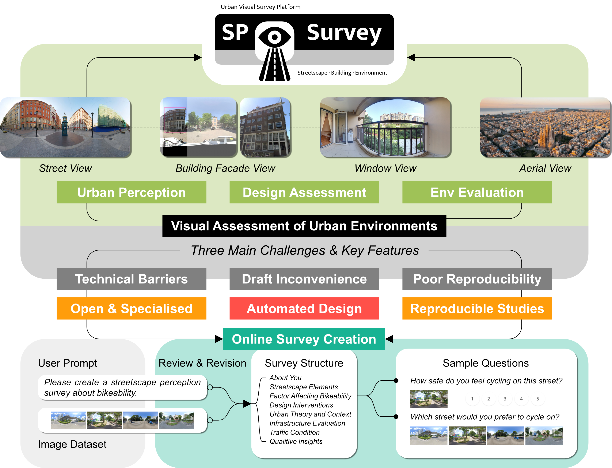
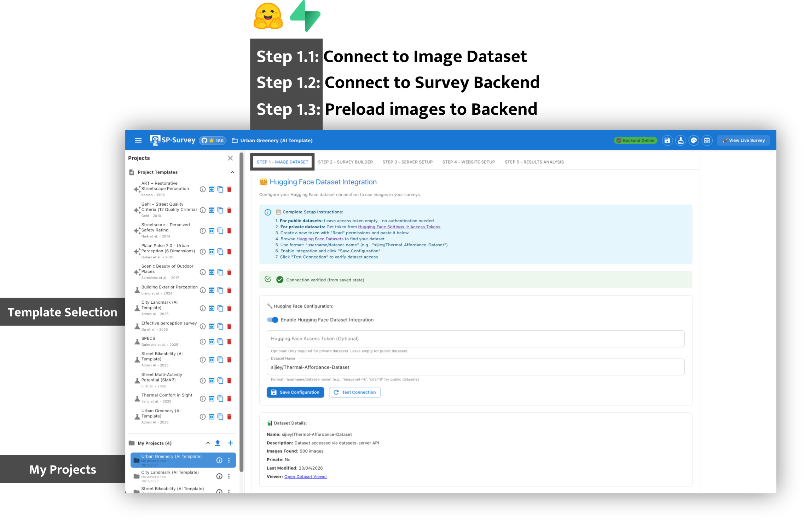
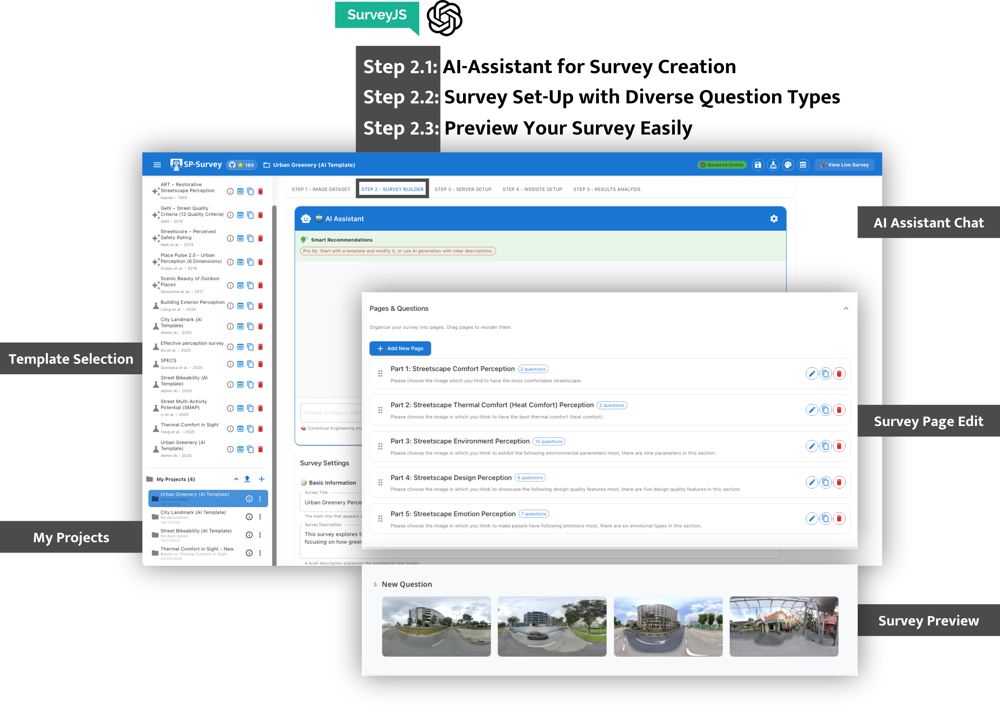
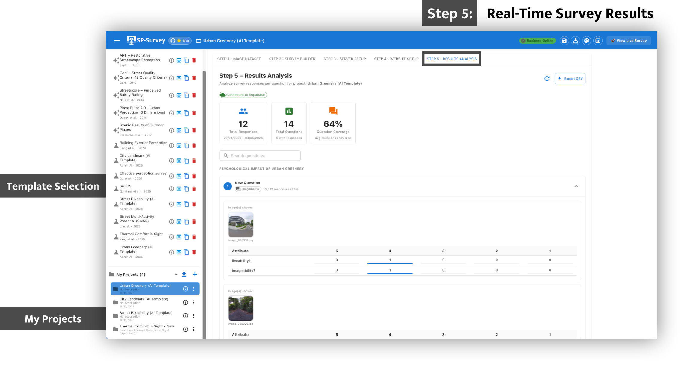
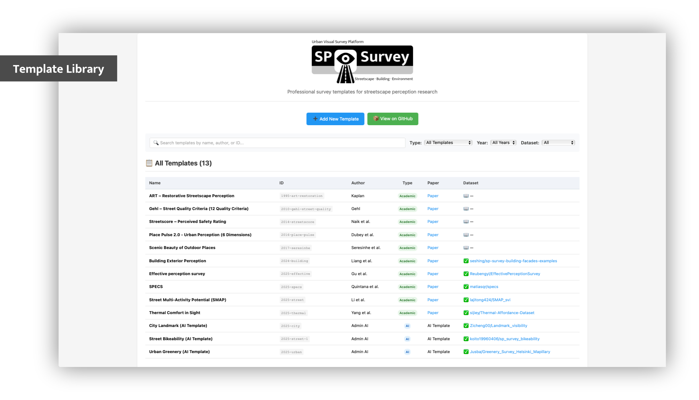

<div align="center">

# 🏙️ SP-Survey (Streetscape Perception Survey)

[](https://github.com/Sijie-Yang/Streetscape-Perception-Survey)
[](https://www.sciencedirect.com/science/article/pii/S0360132325000514)
[](https://sp-survey.org)
[](https://creativecommons.org/licenses/by/4.0/)
[](https://reactjs.org/)



<strong>A professional, research-grade platform for conducting visual perception surveys.</strong>
<br>
No coding required – build surveys through an intuitive admin panel with drag-and-drop, real-time preview, AI-powered generation, and cloud integration.

🌐 <a href="https://sp-survey.org"><strong>Use the Hosted Platform — sp-survey.org</strong></a> •
📄 <a href="https://www.sciencedirect.com/science/article/pii/S0360132325000514"><strong>Research Paper</strong></a> •
🔗 <a href="https://thermal-affordance.ual.sg"><strong>Project Website</strong></a> •
📊 <a href="https://github.com/Sijie-Yang/Thermal-Affordance"><strong>Dataset</strong></a>


&nbsp;&nbsp;&nbsp;&nbsp;

&nbsp;&nbsp;&nbsp;&nbsp;


</div>

---

## 🚀 Two Ways to Use SP-Survey

### Option A — Use the Hosted Platform (Recommended)

**No setup required.** Create an account at **[sp-survey.org](https://sp-survey.org)** and start building surveys immediately.

👉 **[https://sp-survey.org](https://sp-survey.org)**

- ✅ Official hosted platform at **sp-survey.org** — no server, deployment, or configuration
- ✅ Your projects and data are stored securely in the cloud
- ✅ Share survey links directly with participants — no hosting needed
- ✅ Access from anywhere, including mainland China

---

### Option B — Self-Host (Open Source)

Run your own instance with your own Supabase database.

#### Prerequisites

- **Supabase Account** — [supabase.com](https://supabase.com) (free tier available)
- **Node.js 18+**
- **OpenAI API Key** (optional — for AI survey generation)

#### Installation

```bash
# Clone the repository
git clone https://github.com/Sijie-Yang/Streetscape-Perception-Survey.git
cd Streetscape-Perception-Survey

# Install dependencies
npm install

# Copy the environment template
cp .env.example .env
```

#### Configure Environment Variables

Edit `.env` with your Supabase credentials:

```env
REACT_APP_SUPABASE_URL=https://your-project-id.supabase.co
REACT_APP_SUPABASE_ANON_KEY=your-anon-key-here

# Optional
REACT_APP_OPENAI_API_KEY=sk-...
```

Get these from: **Supabase Dashboard → Project → Settings → API**

#### Set Up the Database

Run the following SQL in your **Supabase SQL Editor**:

```sql
-- Projects table (stores survey configs per user)
CREATE TABLE projects (
  id                   TEXT PRIMARY KEY,
  user_id              UUID REFERENCES auth.users(id) ON DELETE CASCADE,
  name                 TEXT NOT NULL,
  description          TEXT DEFAULT '',
  survey_config        JSONB DEFAULT '{}',
  image_dataset_config JSONB DEFAULT '{}',
  preloaded_images     JSONB DEFAULT '[]',
  preloaded_at         TIMESTAMPTZ,
  preloaded_source     TEXT,
  template_id          TEXT,
  created_at           TIMESTAMPTZ DEFAULT now(),
  updated_at           TIMESTAMPTZ DEFAULT now()
);
ALTER TABLE projects ENABLE ROW LEVEL SECURITY;
CREATE POLICY "Users manage their own projects" ON projects
  FOR ALL USING (auth.uid() = user_id) WITH CHECK (auth.uid() = user_id);

-- Survey responses table
CREATE TABLE survey_responses (
  id               BIGSERIAL PRIMARY KEY,
  participant_id   TEXT NOT NULL,
  project_id       TEXT,
  responses        JSONB DEFAULT '{}',
  displayed_images JSONB DEFAULT '[]',
  survey_metadata  JSONB DEFAULT '{}',
  created_at       TIMESTAMPTZ DEFAULT now()
);
ALTER TABLE survey_responses ENABLE ROW LEVEL SECURITY;
CREATE POLICY "Anyone can submit" ON survey_responses FOR INSERT WITH CHECK (true);
CREATE POLICY "Public read" ON survey_responses FOR SELECT USING (true);
```

Also create a **Storage bucket** named `survey-images` (public) and add these policies:

```sql
CREATE POLICY "Users access own folder" ON storage.objects FOR ALL TO authenticated
  USING (bucket_id = 'survey-images' AND split_part(name, '/', 1) = auth.uid()::text)
  WITH CHECK (bucket_id = 'survey-images' AND split_part(name, '/', 1) = auth.uid()::text);

CREATE POLICY "Public read images" ON storage.objects FOR SELECT TO public
  USING (bucket_id = 'survey-images');
```

#### Start the Application

```bash
npm run dev
```

- **Admin Panel**: http://localhost:3000/admin
- **Live Survey**: http://localhost:3000/survey?project=YOUR_PROJECT_ID

#### Deploy to Cloudflare Pages (Recommended)

1. Push your repo to GitHub
2. Connect to [Cloudflare Pages](https://pages.cloudflare.com) → Build command: `npm run build` → Output: `build`
3. Add environment variables in Cloudflare Pages → Settings → Environment Variables
4. Add your Cloudflare Pages domain to Supabase → Authentication → URL Configuration → Redirect URLs

---

## 🪜 Workflow

**Step 1 — Image Dataset**
Upload images directly to Supabase Storage (auto-compressed to ≤300 KB in your browser).
Optionally batch-import from a HuggingFace dataset.

<p align="center">
  
</p>

**Step 2 — Survey Builder**
Design your survey with image-based question types using a drag-and-drop editor or AI-powered generation.

<p align="center">
  
</p>

**Step 3 — Share Survey**
Copy your survey link and share it with participants. No deployment needed — the survey is already live.

**Step 4 — Results Analysis**
Analyze responses per question with automatic image–response pairing, specialized charts for image and skill questions, inter-rater reliability metrics, and CSV export (including `__shown_images` columns for media questions).

<p align="center">
  
</p>

---

## ✨ Key Features

### 🤖 AI-Powered Survey Generation

- **ChatGPT-Style Interface**: Natural conversation to create and refine surveys
- **Chain of Thoughts**: Transparent 3-step AI reasoning process
- **Multi-Agent Review**: 5 specialized AI experts review your survey
- **Contextual Memory**: AI remembers your preferences and project history

### 🔧 Survey Capabilities

**Image & Media Questions:**
- **Image Choice** (`imagepicker`) — Compare streetscape designs; TrueSkill ranking in results
- **Image Ranking** (`imageranking`) — Preference hierarchies
- **Image Rating** (`imagerating`) — Quantify comfort, safety, aesthetics (1–5 scale)
- **Image Yes/No** (`imageboolean`) — Binary assessments with image panel
- **Image Matrix** (`imagematrix`) — Multi-criteria evaluation per image
- **Image Display** (`image`) — Single reference image (random or fixed)
- **Media Display** (`mediadisplay`) — Image galleries, video, or audio
- **Media Rating / Yes–No** (`mediarating`, `mediaboolean`) — Rating or boolean below media panel
- **Image Annotation** (`imageannotation`) — Click/drag regions on an image (min/max limits configurable)
- **Image Slider Group** (`imageslidergroup`) — Semantic differential sliders below images
- **Image Point Allocation** (`imagepointallocation`) — Budget allocation across shown images

**Text & Structured Questions:**
- Text input, multi-line comments, single/multiple choice, dropdown
- Rating scales, ranking, boolean, matrix
- **Slider Group** (`slidergroup`) — Multi-dimensional semantic differentials
- **Point Allocation** (`pointallocation`) — Fixed budget across text choices

**Custom Skill Questions** (`skillquestion`):
Interactive iframe tasks with media injection (random images/videos from your dataset). Built-in presets include:
- **Pairwise Preference Slider** — A/B image comparison on a continuous scale
- **Best–Worst Choice (MaxDiff)** — Best–worst scaling with BWS scores
- **Video Key Moment Tagging** — Mark start/end of key events on a timeline
- **Continuous Video Rating** — Moment-by-moment slider ratings while watching
- **Emotion Color Picker** — Configurable palette (12 hue bins / basic colors / Plutchik-inspired), or wheel / image sampling; intensity derived from color
- **Composite Blocks** — Configurable blocks (media, sliders, word chips, choice, text)

Import custom skills from the Skill Library or author HTML/JS with the `SPSkill` SDK. Skills support `skillConfig`, random media assignment, and structured `resultSchema` for analysis.

**Media Assignment:**
- Random selection from preloaded images/videos with optional **group** or **category** pairing
- Per-question image counts; exclude previously used images across the survey
- Tracks `shown_images`, media group, and categories in every response for reproducible analysis

**Research Features:**
- Multi-page surveys with progress tracking and draft resume
- Fully responsive design (touch-friendly skill iframes)
- Drag-and-drop builder with real-time preview
- Multi-language support (English / 中文)
- Response quality flags, Krippendorff's α / percent agreement where applicable
- Methods text export and per-question CSV downloads

### 📊 Results Analysis

- **Per-question cards** grouped by survey page with response rates
- **Image questions**: compact thumbnail rankings, TrueSkill (imagepicker), matrix column-proportion sorts
- **Skill questions**: preset-specific charts (preference histograms, MaxDiff BWS, video timelines, emotion hue wheel, etc.) linked to **shown media**
- **Raw responses**: answer fields only; shown media listed separately (not mixed into JSON)
- **CSV export**: answer columns + `__shown_images` / `__shown_media_group` / `__shown_media_categories` for media and skill questions

---

## 📋 Template System

<p align="center">
  
</p>

Start with peer-reviewed survey designs from published research. Templates can be imported from the admin **Template Library** (existing project IDs are skipped on re-import).

#### Platform QA
- **SP All Question Types (2026)** — Full QA template covering all native question types and seven preset skills (`2026-sp-all.json`)

#### 2025–2026
- **Thermal Comfort in Sight** | Yang et al. | [Paper](https://www.sciencedirect.com/science/article/abs/pii/S0360132325000514) | `2025-yang-thermal.json`
- **SPECS** | Quintana et al. | [Paper](https://www.nature.com/articles/s44284-025-00330-x) | `2025-quintana-specs.json`
- **Street Multi-Activity Potential** | Li et al. | [Paper](https://www.sciencedirect.com/science/article/pii/S0198971525001036) | `2025-li-street.json`
- **Effective Perception Survey** | Gu et al. | [Paper](https://doi.org/10.1016/j.landurbplan.2025.105368) | `2025-gu-effective.json`
- **Urban / City / Street (admin variants)** | `2025-torkko-urban.json`, `2025-fan-city.json`, `2026-peng-city.json`, etc.

#### 2024
- **Building Exterior Perception** | Liang et al. | [Paper](https://doi.org/10.1016/j.buildenv.2024.111875) | `2024-liang-building.json`

#### Classic benchmarks
- **Place Pulse** (2016) | Dubey et al. | `2016-dubey-place.json`
- **Streetscore** (2014) | Naik et al. | `2014-naik-streetscore.json`
- **Gehl street quality** (2010) | `2010-gehl-gehl.json`
- **Kaplan art restoration** (1995) | `1995-kaplan-art.json`
- **Scenicness** (2017) | Seresinhe et al. | `2017-seresinhe-scenic.json`

See `public/project_templates/index.json` for the full catalog.

---

## 🎓 Academic Citation

```bibtex
@article{yang2025thermal,
  title={Thermal comfort in sight: Thermal affordance and its visual assessment for sustainable streetscape design},
  author={Yang, Sijie and Chong, Adrian and Liu, Pengyuan and Biljecki, Filip},
  journal={Building and Environment},
  pages={112569},
  year={2025},
  publisher={Elsevier}
}
```

**📄 [Read the Paper](https://www.sciencedirect.com/science/article/pii/S0360132325000514)** | **🔗 [Project Website](https://thermal-affordance.ual.sg)** | **📊 [Dataset](https://github.com/Sijie-Yang/Thermal-Affordance)**

---

## 🆘 Troubleshooting

### Images Not Loading
1. Check the `survey-images` Supabase bucket is set to **Public**
2. Verify storage RLS policies are applied
3. Images are auto-compressed to ≤300 KB on upload

### Cannot Sign In
1. Check `REACT_APP_SUPABASE_URL` and `REACT_APP_SUPABASE_ANON_KEY` in `.env`
2. Restart dev server after changing `.env`
3. Make sure email confirmation is disabled (for development) or SMTP is configured

### Survey Shows Wrong Content
1. Make sure the URL includes `?project=YOUR_PROJECT_ID`
2. Save your project in the Admin Panel before sharing the link

### Skill Questions on the Same Page
Each skill question runs in its own iframe. If multiple skills appear on one page, ensure you are on the latest version (postMessage is scoped per iframe). Place unrelated video skills on separate pages if participants report cross-talk on very old deployments.

### Results Show Wrong Media for Skills
1. Confirm random media was assigned (check `__shown_images` in CSV export)
2. Re-collect responses after updating the platform — older submissions may lack `shown_images` metadata

**Getting Help:**
- **GitHub Issues**: [Report a bug](https://github.com/Sijie-Yang/Streetscape-Perception-Survey/issues)
- **Discussions**: [Ask questions](https://github.com/Sijie-Yang/Streetscape-Perception-Survey/discussions)

---

## 🤝 Contributing

We welcome contributions! Please open an issue or pull request to discuss your ideas.

**Production already has users.** For schema, R2, survey JSON, or live-link changes, follow **[COMPATIBILITY.md](./COMPATIBILITY.md)** (safe release order, checklist, and breaking-change playbook).

---

## 📄 License

**CC BY 4.0 (Creative Commons Attribution 4.0 International)**

This work is licensed under a [Creative Commons Attribution 4.0 International License](https://creativecommons.org/licenses/by/4.0/).

- ✅ Share — copy and redistribute the material
- ✅ Adapt — remix, transform, and build upon the material
- ✅ Commercial use allowed
- 📝 **Attribution** — You must give appropriate credit and cite the original paper

---

## 🌟 Acknowledgments

**Developed by Urban Analytics Lab, Department of Architecture, National University of Singapore**

**Technology Stack:**
- SurveyJS, Material-UI, React 18.2
- OpenAI GPT-4o (AI features)
- Supabase & Cloudflare R2 (Database, Storage & Auth)
- Hugging Face (Dataset hosting)
- Cloudflare Pages (Deployment)
